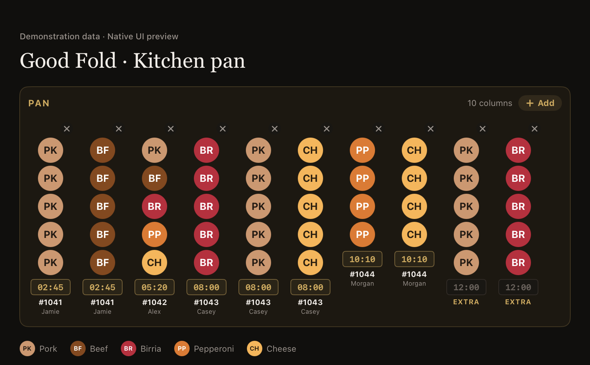
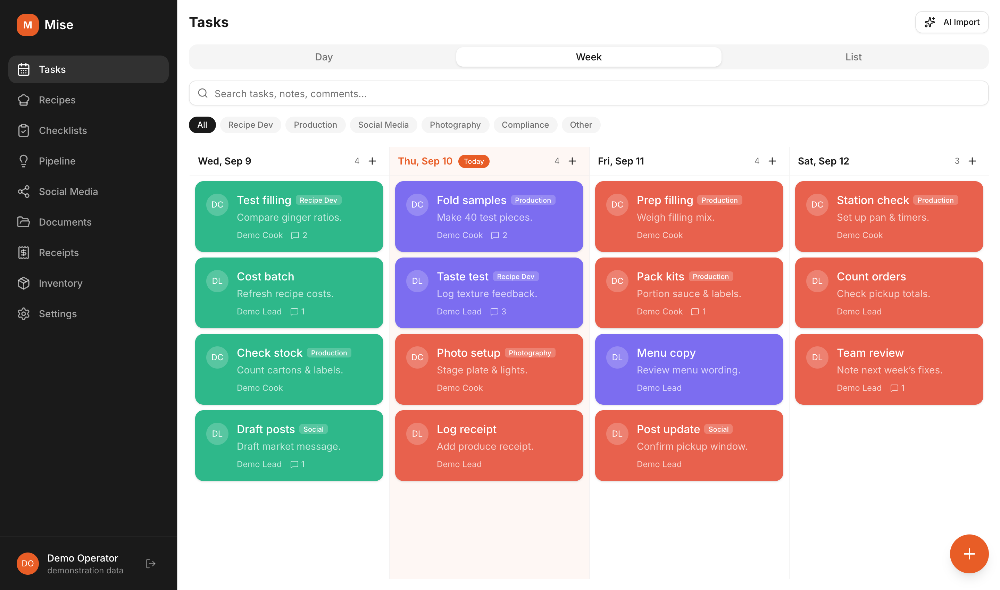
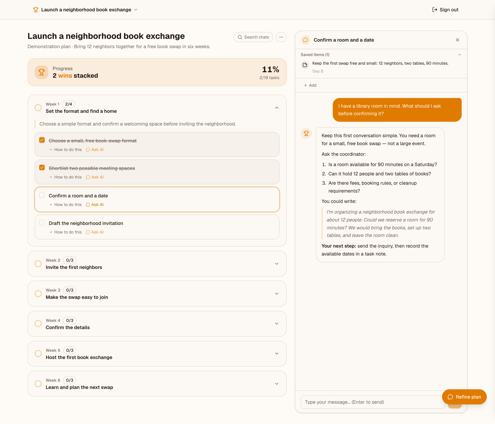
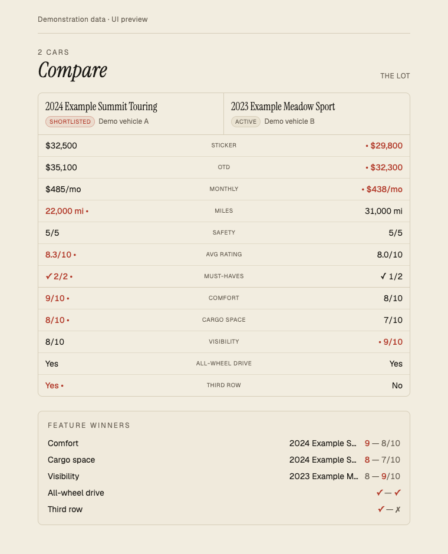

# Jon Lamb

I co-lead **Kinetech's Public Sector & Nonprofit practice**, with responsibility for software delivery, product direction, and practice operations. My background includes client financial management at **Accenture**. I'm a Mendix Expert Developer and certified trainer.

[Portfolio](https://jonlamb.co) · [Resume](https://jonlamb.co/resume)

## Technical Interests & Pursuits

Outside work, I build tools for problems I encounter—from running a food business to shopping for a car. I use AI-assisted development extensively and explore AI within the products themselves. The projects below are personal builds; they reflect hands-on development and experimentation alongside my enterprise software delivery experience.

### Good Fold — iOS ordering and kitchen operations

A connected ordering and kitchen system I built for my food business. The native iOS app was released on the App Store, and I used it to take orders that appeared on the kitchen computer for preparation and pickup. The system also includes a web storefront, Square payments, shipping labels, and sales reporting.

[Case study](https://jonlamb.co/work/good-fold-shop) · [Live storefront](https://goodfold.co) · [Sales and order screenshots](screenshots.md#good-fold-weekly-sales)

*Demonstration data · native kitchen component preview.*

### Mise — small-business operations

An internal tool for Good Fold that brings weekly tasks, recipe development and costing, and receipt reconciliation together. AI turns written agendas into draft tasks and extracts receipt details. Receipts can be matched against imported bank transactions, with uncertain matches held for review.

[Case study](https://jonlamb.co/work/mise) · [Recipe-management screenshot](screenshots.md#mise-recipe-management)

*Demonstration data · weekly task board.*

### Stacking Wins — goals into weekly action

An AI coaching app that turns a goal-setting conversation into a six-week action plan. Weekly checklists track progress, and a coach within each task helps work through the next step.

[Visit site](https://stackingwins.ai)

*Demonstration data · weekly plan and sample task-coaching conversation.*

### The Lot — car-shopping field notes

Photograph a car-window specification sheet, extract the details into a saved vehicle record, and compare cars side by side. Photos, notes, and ratings keep the shopping decision attached to the actual cars under consideration.

*Demonstration data · comparison UI preview.*

### Handshake Worthy — Grok Bot test project

An unofficial archive of Hollywood Handshake bakes from *The Great British Bake Off*, built as a fun Grok Bot experiment. I directed the bot to build the site and keep finding missing recipes and photos between sessions.

[Visit test project](https://www.handshake-worthy.com/)

**Also exploring: Loop Closed.** A development prototype that turns narrated screen recordings into structured coding-agent instructions, with MCP tools for retrieving the resulting work items.

Application source stays private. This profile shares selected work, visuals, and public links.
