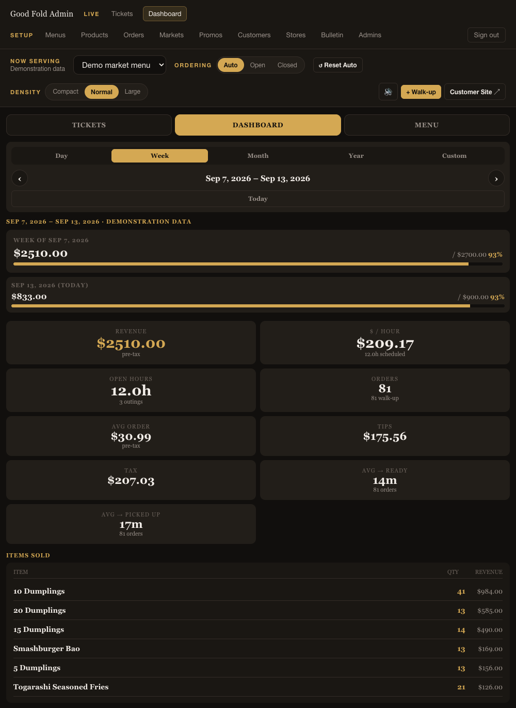
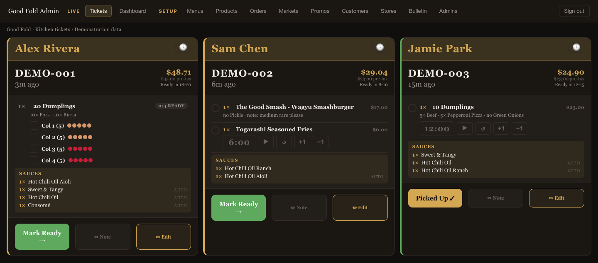
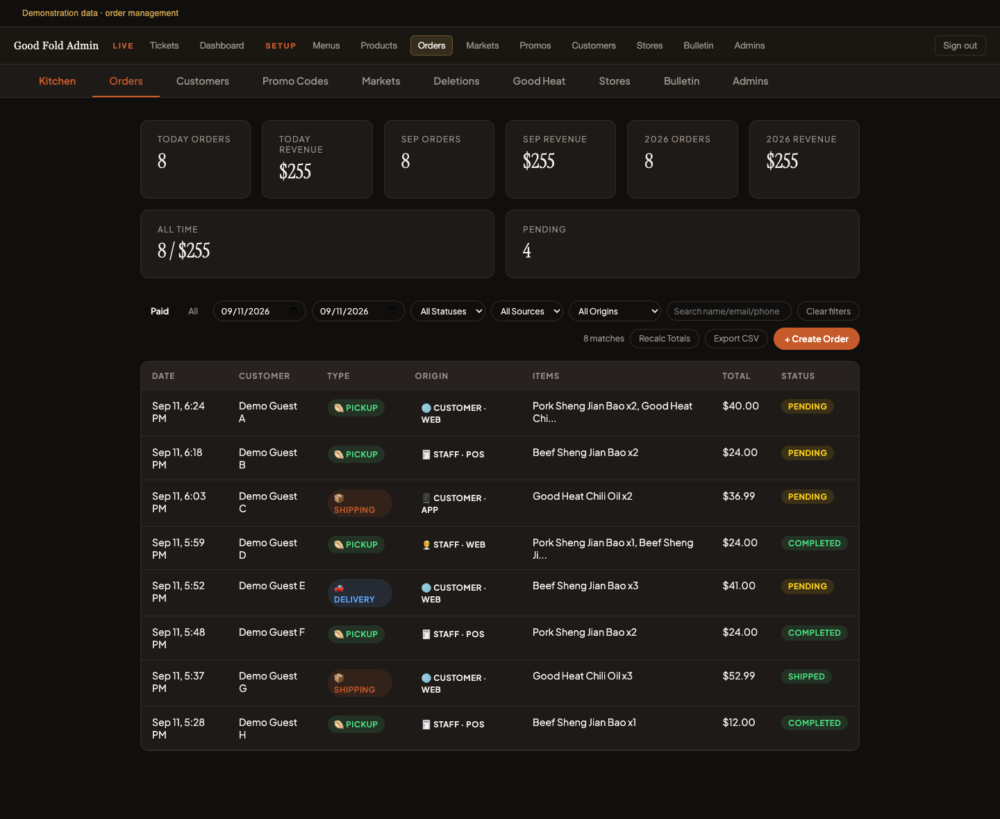
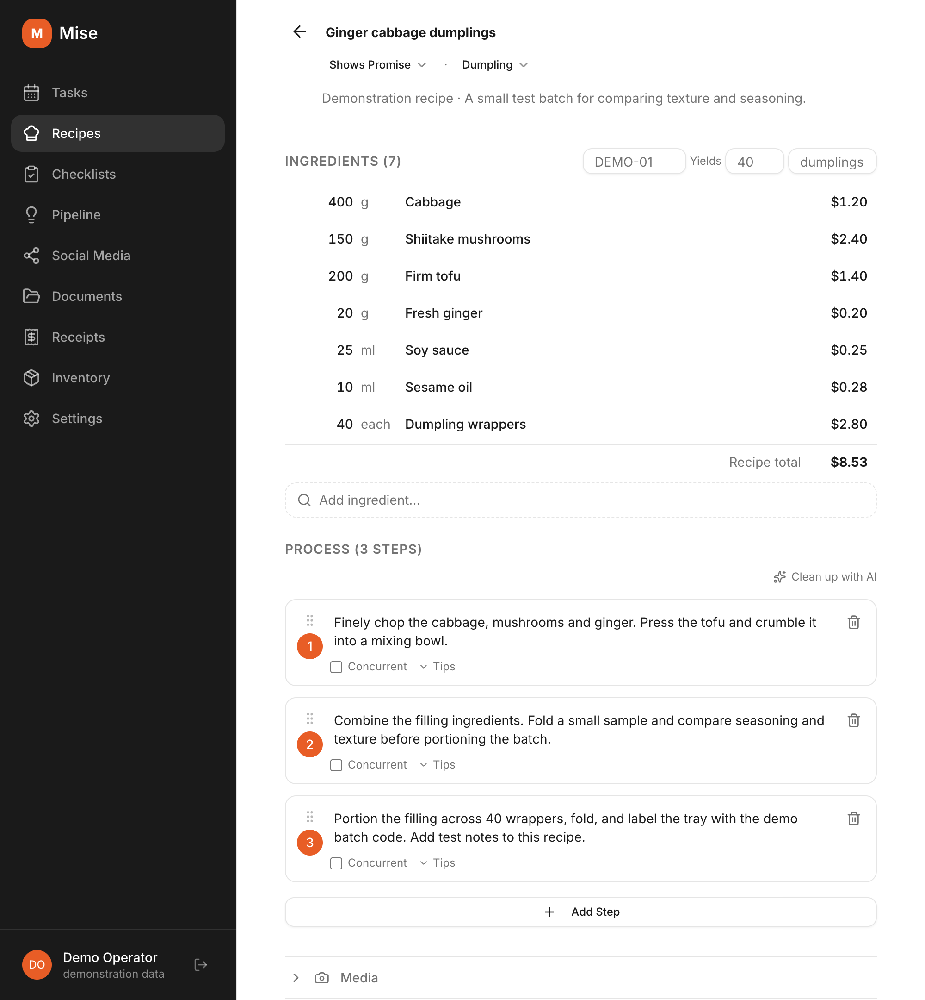

# Selected product screens

[Back to profile](README.md)

These are actual application interfaces rendered locally with fictional demonstration data. Sales figures, orders, people, and recipes are examples; they are not business results or production records.

## Good Fold weekly sales

Weekly pop-up sales, progress against goals, operating hours, average order value, service times, and items sold.

## Good Fold kitchen tickets

The web kitchen view organizes incoming orders for preparation and pickup, complementing the iOS app used to take orders.

## Good Fold incoming orders

Customer web/app and staff-entered orders in one management view, with pickup, delivery, shipping, and order status visible.

## Mise recipe management

Recipe lifecycle status, ingredients, batch costs, and preparation steps, using an invented sample recipe.

